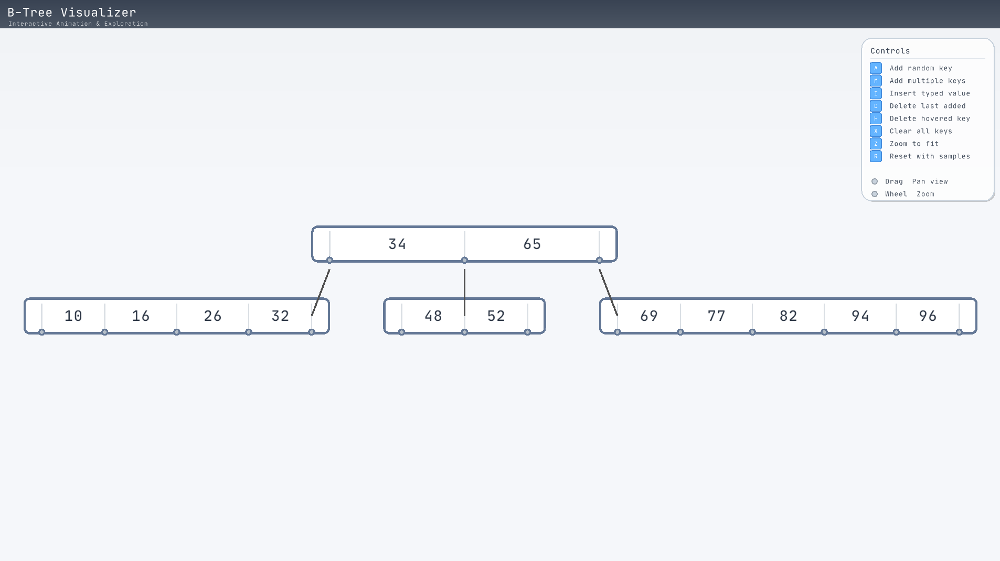
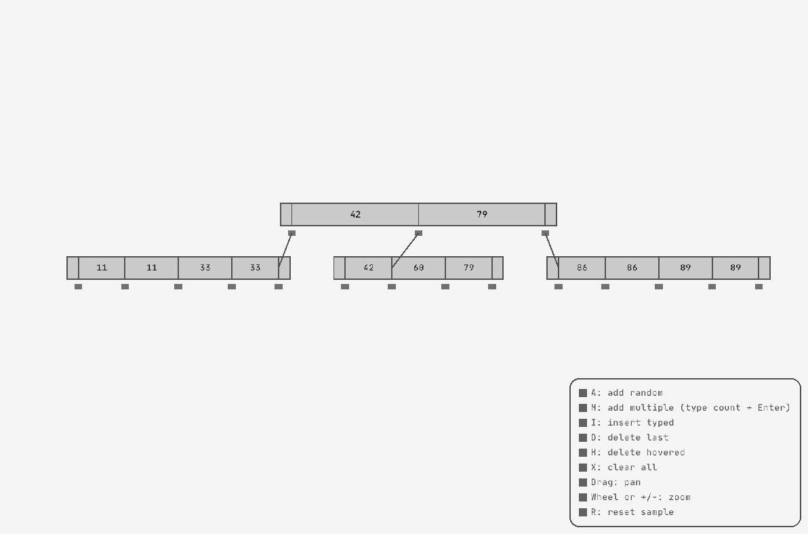

# B-Tree Visualizer

This project implements a simple B-Tree and a Raylib-based visualizer with interactive controls.

Controls (keyboard & mouse)
- A : Add a single random key (incrementing seed)
- M : Add multiple random keys — press M, type a count, then Enter to insert that many
- I : Insert a specific key — press I, type the number, then Enter
- D : Delete the last-inserted key
- H : Delete the hovered key (hover over a key then press H)
- X : Clear all keys (reset tree)
- Z : Fit view to show the whole tree
- R : Reset the example scene (starts with 8 random keys)
- ESC: Cancel typing input
- Mouse drag (left button) : Pan the view
- Mouse wheel or +/- : Zoom in/out

Typing behavior
- When you press M or I the app enters typing mode; type digits (and an optional leading -), then press Enter to commit or Esc to cancel.

UI notes
- Hover a key with the mouse to highlight it; the hover value is shown in the legend.
- A legend is shown at the bottom-right with available controls and indicators.

## Preview

### Latest Version (Build 13)



**Video Demo:**

<video src="https://github.com/user-attachments/assets/c61c9a09-d7fd-442f-87ad-b8894f540115" controls width="100%"></video>

<details>
<summary>📸 Old Version (Build 1) - Click to expand</summary>



</details>

## Build (Linux/macOS)
Run a single-line configure+build (recommended):

```fish
cmake -S . -B build && cmake --build build -- -j4
```

This will download Raylib via CMake's FetchContent and build the executable into `build/bin`.

## Build (Windows - Visual Studio)
Open a "x64 Native Tools Command Prompt" (or use CMake GUI). Then:

```powershell
cmake -S . -B build -G "Visual Studio 17 2022" -A x64
cmake --build build --config Release
```

## Build (Web - Emscripten)
Build for web browsers using WebAssembly:

```bash
./build-web.sh
```

Or manually with Emscripten:

```bash
emcmake cmake -S . -B build-web -DCMAKE_BUILD_TYPE=Release -DPLATFORM=Web
cmake --build build-web -j4
```

Then serve locally:
```bash
cd build-web/bin && python3 -m http.server 8000
```

See [web/README.md](web/README.md) for detailed instructions.

## Prerequisites
- CMake (>= 3.24) installed and available on PATH. Install from https://cmake.org if needed.
- A C/C++ toolchain: GCC/Clang on Linux/macOS or Visual Studio on Windows.

## Notes
- The build uses FetchContent to download raylib automatically. If you are offline, pre-populate `build/_deps` or install raylib system-wide.
